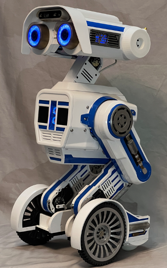

# EB-6 Robot
## Interactive robot with AI chat, speech recogniton, text to speech, etc.
### Videos: 
  - [AI trying to trick user](https://youtube.com/shorts/k754uDlYR40?feature=share) 
  - [Happy Dance](https://youtube.com/shorts/6MphU05JQVU?feature=share)

### Electronics Design, Software Design, CAD files, etc. available at www.dshinsel.com/eb6

## Software Requirements
Software runs on ROS1 Noetic, but could be easily ported to ROS2. All modules are Python3, with minimal C++ to make it easy for hobbyest to use and modify.  See software overview on www.dshinsel.com for more info.

### Hardware Requirements
- Old Intel Nuc Gen8 i7 16GB (runs at ~50% CPU)
- 14 Robotis Dynamixel servos
- 2 USB cameras (1 required)
- 2 arduinos (I use Adafruit Feather M4)
- Intel RealSense D435 depth camera (optional)

## Dependencies (a work in progress)
- ROS Noetic (or port to your version)
- Piper Voice Text to Speech
  - [Piper](https://github.com/rhasspy/piper)
- Arduino IDE for Linux
  - [Arduino Linux Guide](https://www.arduino.cc/en/Guide/Linux)
- Google Speech Recognition
  - Requires (free?) account and creation of keys
  - [Google Cloud Console](https://console.cloud.google.com/) 
- Picovoice for Wakeword spotting
  - Requires (free?) account to get a key. Also allows training of your own custom wakeword(s)
  - [Picovoice Porcupine](https://picovoice.ai/platform/porcupine/)
- For Bluetooth phone control of robot:
  - [MIT App Inventor](https://appinventor.mit.edu/)
  - EB-6 code is in ./eb/Arduino/mit_ai_inventor
- Pygame for async music playback
  - sudo -H pip install pygame
    
- I'll add more as I think of them...
